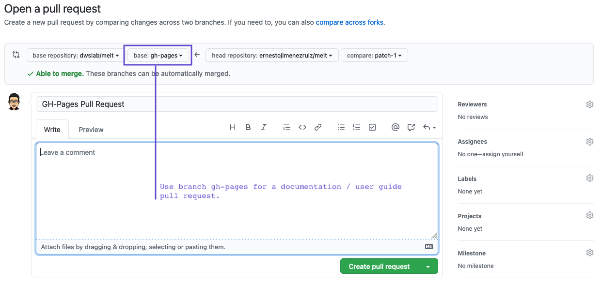

# Contribute
Everybody is welcome to contribute to MELT. There are 3 options to help the project:

1. [**Spread the Word**](#spread-the-word)
2. [**Improve the Documentation**](#improve-the-documentation)
3. [**Improve and Extend the Code Base**](#improve-and-extend-the-code-base)

## Spread the Word
If you are using MELT, [reference](https://dwslab.github.io/melt/cite-melt) and recommend the framework to peers. 
In case you experience any (potential) bugs, [open an issue on GitHub](https://github.com/dwslab/melt/issues). 

For specific questions, feel free to contact the authors of the [main paper](https://dwslab.github.io/melt/cite-melt) (or the paper addressing the component you have a question about).

## Improve the Documentation
You do not have to be a programmer to help MELT. You can easily help us by improving the documentation (this user guide). The contents of the guide are managed through GitHub; just go to the [MELT gh-pages branch](https://github.com/dwslab/melt/tree/gh-pages). There, you will find a [markdown](https://en.wikipedia.org/wiki/Markdown) file for every page in this user guide. The markdown file for this page, for instance can be found here: [https://github.com/dwslab/melt/blob/gh-pages/8_contribute/0_contribute.md](ttps://github.com/dwslab/melt/blob/gh-pages/8_contribute/0_contribute.md)

You can easily change files directly in your Web browser by clicking on the edit pencil as shown in the following screen shot:

Note that when you commit a documentation change, you have to set the pull request for branch `gh-pages` (not `master`):

Alternatively to changes in the Web UI, you can also [fork the project](https://docs.github.com/en/get-started/quickstart/fork-a-repo) (remember to `git checkout gh-pages`), apply your changes locally, and perform a [pull request]((https://docs.github.com/en/github/collaborating-with-pull-requests/proposing-changes-to-your-work-with-pull-requests/creating-a-pull-request)).

After you applied your changes and they have been confirmed by the administrators, the new page will be automatically built by our pipeline and will immediately appear in the rendered user guide.

## Improve and Extend the Code Base
If you are knowlegeable in Java and/or Python and you want to add features to MELT or fix bugs: Simply [fork the repository](https://docs.github.com/en/get-started/quickstart/fork-a-repo) and [create a pull request](https://docs.github.com/en/github/collaborating-with-pull-requests/proposing-changes-to-your-work-with-pull-requests/creating-a-pull-request). We are happy to merge any improvements in the main branch.

MELT code quality is ensured by more than 200 [unit tests](https://junit.org/junit5/docs/current/user-guide/#:~:text=JUnit%20Jupiter%20is%20the%20combination%20of%20the%20new,JUnit%204%20based%20tests%20on%20the%20platform.%201.2.). You can check that you did not accidently break anything with your changes by running them. Ideally, you also create a unit test for your new feature / your fix to ensure that it works as intended.