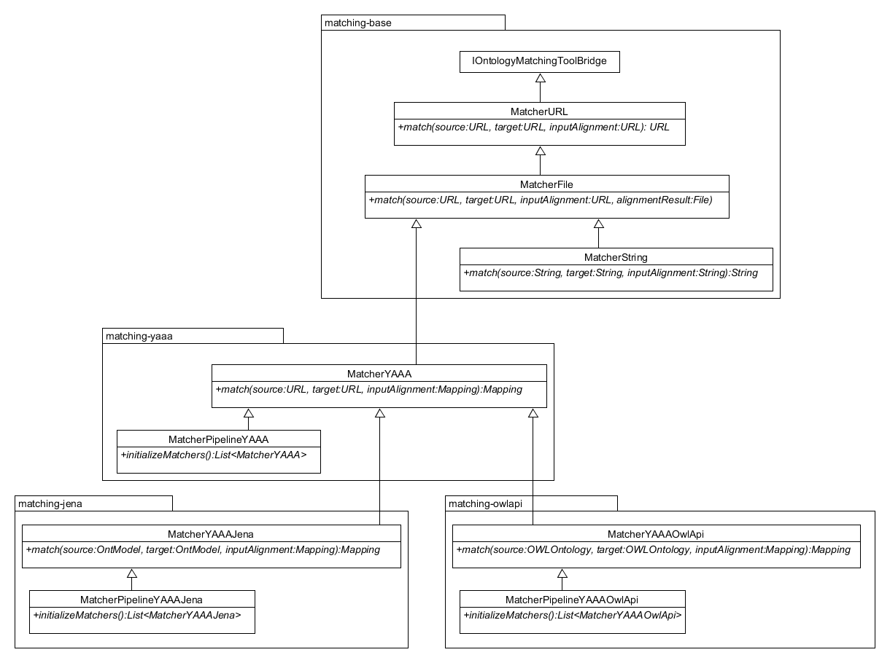

# MELT - Matching EvaLuation Toolkit
[](https://travis-ci.org/dwslab/melt)

MELT is a helpful maven framework for developing, tuning, evaluating, and packaging ontology matching systems.
It is optimized to be used in [OAEI](http://oaei.ontologymatching.org/) campaigns and allows to submit matchers to the 
SEALS and HOBBIT evaluation platform easily. MELT can also be used for non OAEI-related matching tasks and evaluation.

**How to Cite?** <br/>
```
Hertling, Sven; Portisch, Jan; Paulheim, Heiko. MELT - Matching EvaLuation Toolkit. SEMANTICS. Karlsruhe. 2019.
```
An open-access version of the paper is available <a href="https://link.springer.com/content/pdf/10.1007%2F978-3-030-33220-4_17.pdf">here</a>.


## Code Examples
The [examples folder](/examples/) contains reference examples that you can use to better understand how MELT can be used for 
different tasks and that can be used as barebone project for specific applications. [Javadoc](https://dwslab.github.io/melt/) is also available.

## Matcher Development in Java

### TL;DR
1. Pick a class to start with depending on your needs. If you start from scratch `MatcherYAAAJena` or `MatcherYAAAOwlApi` 
are the best fit depending on whether your prefer [Jena](https://jena.apache.org) or the [OWL API](http://owlcs.github.io/owlapi/). 
Classes that can be extended for matcher implementation:
    * `MatcherURL`
    * `MatcherYAA`
    * `MatcherYAAAJena`
    * `MatcherYAAAOwlApi`
1. Implement the `match()` method.

### In More Detail

#### Yet Another Alignment API (YAAA)
MELT introduces a simple API for matcher development. In the following, the most important classes are
explained: 
- `Correspondence`<br/>A Correspondence contains a relation (`CorrespondenceRelation`) that holds between two elements from two different ontologies. 
In the literature, it is also known as "Mapping Cell" or "Cell". Optionally, a correspondence might have a confidence value,
and an identifier. Note that a correspondence can be extended with further attributes. For usability, class `DefaultExtensions`
contains the most common extensions. 
- `Alignment`<br/>An alignment is a collection of multiple `Correspondence` instances. In the literature, it is also 
known as "mapping" or "mappings".

Class `AlignmentSerializer` can be used to persist an alignment to a file and class `AlignmentParser` can parse an alignment
file directly into a Java object. 

#### Development Options
In order to develop a matcher in Java with MELT, the first step is to decide which matching interface to implement.
The most general interface is encapsulated in class`MatcherURL` which receives two URLs of the ontologies to be matched 
together with a URL referencing an input alignment. The return value should be a URL representing a file with 
correspondences in the alignment format. Since this interface is not very convenient, we also provide more specialized 
classes.
In the `matching-yaaa` package we set the alignment library to YAAA. All matchers implementing interfaces from this 
package have to use the library and get at the same time an easier to handle interface of correspondences.
In further specializations we also set the semantic framework which is used to represent the ontologies.
For a better usability, the two  most well-known frameworks are integrated into MELT: [Apache Jena](https://jena.apache.org) (`MatcherYAAAJena`) 
and the [OWL API](http://owlcs.github.io/owlapi/) (`MatcherYAAAOwlApi`). 
As the latter two classes are organized as separate maven projects, only the libraries which are actually 
required for the matcher are loaded. In addition, further services were implemented such as an ontology cache 
which ensures that ontologies are parsed only once. This is helpful, for instance, when the matcher accesses an 
ontology multiple times, when multiple matchers work together in a pipeline, or when multiple matchers shall be evaluated.
The different levels at which a matcher can be developed as well as how the classes presented in this section work together, 
are displayed in the figure below.




## External Matcher Development
MELT allows to develop a matcher in any other programming language and wrap it as a SEALS or HOBBIT package. 
Therefore, class [`MatcherExternal`](/matching-external/src/main/java/de/uni_mannheim/informatik/dws/ontmatching/matchingexternal/MatcherExternal.java) 
has to be extended. The interface for the external process is simple. It receives the input variables via the command 
line and outputs the results via the standard output of the process - similar to many Unix command line tools. 
All external resources have to be placed in a directory named `oaei-resources`. An example project for a 
Python matcher can be found [here](/examples/externalPythonMatcher).


## Matcher Evaluation
For a local evaluation within MELT, multiple Metrics and Evaluators are available.

### TL;DR

* MELT defines a simple work flow: After you implemented your matcher, hand it over to an `Executor` and call `run()`.
* If you want to evaluate multiple matchers, you can also hand those over to the `Executor`.
* The resulting `ExecutionResultSet` can be given to an evaluator. The default evaluator is `EvaluatorCSV`.
* If you want to implement your own evaluator, extend class `Evaluator` and have a look at our metrics before implementing
your own metric - it might already be there.
* If you know the OAEI and want to use its data: Good. You will never have to download anything from the Web site or fiddle around with file paths. 
MELT can manage all the data. Just have a look at the `TrackRepository`, you will find everything you need there.

### In More Detail
MELT defines a workflow for matcher execution and evaluation. Therefore, it utilizes the vocabulary used by the OAEI: A 
matcher can be evaluated on a `TestCase`, i.e. a single ontology matching task. One or more test cases are summarized in 
a `Track`. MELT contains a built-in `TrackRepository` which allows to access all OAEI tracks and test cases at design time 
without actually downloading them from the OAEI Web page. At runtime `TrackRepository` (see *Further Services* for details) checks whether the required 
ontologies and alignments are available in the internal buffer; if data is missing, it is automatically downloading and 
caching it for the next access. The caching mechanism is an advantage over the SEALS platform which downloads all ontologies 
again at runtime which slows down the evaluation process if run multiple times in a row. If a local data set shall be
evaluated, class `LocalTrack` can be instantiated.

One or more matchers are given, together with the track or test case on which they shall be run, to an `Executor`. The 
Executor runs a matcher or a list of matchers on a single test case, a list of test cases, or a track. The `run()` method 
of the executor returns an `ExecutionResultSet`. The latter is a set of `ExecutionResult` instances which 
represent individual matching results on a particular test case. Lastly, an `Evaluator` accepts an `ExecutionResultSet` 
and performs an evaluation. Therefore, it may use one or more `Metric` objects. MELT contains various metrics, such as a 
`ConfusionMatrixMeric`, and evaluators. Nonetheless, the framework is designed to allow for the further implementation 
of evaluators and metrics.

After the `Executor` ran, an `ExecutionResult` can be refined by a `Refiner`. A refiner takes an individual `ExecutionResult` 
and makes it smaller. An example is the `TypeRefiner` which creates additional execution results depending on the type of 
the alignment (classes, properties, datatype properties, object properties, instances). Another example for an implemented 
refiner is the `ResidualRefiner` which only keeps non-trivial correspondences. Refiners can be combined. This means that 
MELT can calculate very specific evaluation statistics such as the residual precision of datatype property correspondences.


## Packaging Matchers for SEALS and HOBBIT

### TL;DR
1. Have a look at [examples/simpleJavaMatcher](/examples/simpleJavaMatcher)
1. Create hobbit account and gitlab access token
1. Adjust settings in pom.xml to your needs
1. Implement your matcher (see Matcher development)
1. Execute ```mvn deploy``` to create seals zip and deploy docker image to hobbit server
    - if you only execute ```mvn install``` it will create seals zip and hobbit docker image locally
    - if you execute ```mvn package``` only seals zip will be created
1. The seals zip can be found in the target folder and the hobbit docker image in the local docker repository

### In More Detail
- for Hobbit submission
    - Prerequisites for Hobbit is a working docker installation ([download docker](https://www.docker.com/get-docker))
    - create a user account
        - open [http://master.project-hobbit.eu/](http://master.project-hobbit.eu/)  and click on ```Register```
        - user name should be the first part (local part - everything before the @) of your mail address
        - mail: `max.power@example.org` then user name should be `max.power`
        - more information at [the  hobbit wiki page](https://github.com/hobbit-project/platform/wiki/User-registration)
    - update settings in gitlab (in Hobbit every matcher corresponds to a gitlab project)
      - go to page [http://git.project-hobbit.eu](http://git.project-hobbit.eu) and log in (same account as for the platform itself)
      - click on the upper right user icon and choose `settings`
      - create a Personal Access Token (click on `Access Tokens` give it a name and choose only the `api` scope)
      - use this access token and you username and password to create the settings file (see the pom.xml)
- adjust pom.xml to your needs
    - definitely change the following:
        - `groupId` and `artifactId` (only artifactId is used to identify the matcher -> make it unique)
        - `oaei.mainClass`: set it to the fully qualified path to the matcher
        - benchmarks: change the benchmarks to the ones your system can deal with
        - create a settings file with username, password and access_token
- implement your matcher (see Matcher development)
- build your matcher
    - execute maven goals from command line or from any IDE
    - ```mvn package``` will only build seals zip
    - ```mvn install``` will create seals zip and hobbit docker image locally
    - ```mvn deploy``` will create seals zip and deploy docker image to hobbit server
- submit your matcher
    - for SEALS upload the generated seals file ```{artifactId}-{version}-seals.zip``` in the target folder
    - for Hobbit call ```mvn deploy```

### Evaluate your matcher in HOBBIT

- you can start an experiment in hobbit online platform
    - go to page [http://master.project-hobbit.eu/](http://master.project-hobbit.eu/), log in and choose `Benchmarks`
    - select the benchmark you want to use
    - select the system you want to use
    - (optionally) specify configuration parameters and click on `submit`
    - click on the Hobbit ID in the pop up to see the results (reload the page if it is not finished)
    - more information at [the  hobbit wiki page 'Experiments' ](https://github.com/hobbit-project/platform/wiki/Experiments)


## Further Services

### TestCase/Track Validation Service
Creating new tracks and test case can be very cumbersome. The MELT validation service allows you to check whether your 
test cases:
1. Contain parseable ontologies.
2. Contain a parseable reference alignment.
3. Mention only URIs in the reference alignment that also appear in the corresponding source and target ontologies.

Exemplary call using the [`TestCaseValidationService`](/matching-validation/src/main/java/de/uni_mannheim/informatik/dws/ontmatching/validation/TestCaseValidationService.java):
```
URI sourceUri = new File("<path to source ontology file>").toURI();
URI targetUri = new File("<path to target ontology file>").toURI();
URI referenceUri = new File("<path to reference alignment file>").toURI();
TestCase testCase = new TestCase("FSDM", sourceUri, targetUri, referenceUri, null);
TestCaseValidationService validator = new TestCaseValidationService(testCase)
System.out.println(validator);
```
You can also test your track on different versions of Jena and the OWL API automatically
by adapting the [`TrackValidationServiceTest`](/matching-validation/src/test/java/de/uni_mannheim/informatik/dws/ontmatching/validation/TrackValidationServiceTest.java) 
and running `runAll.cmd` in the Windows shell. The release versions to be tested can be edited in the corresponding
[`pom.xml`](/matching-validation/pom.xml).


### OAEI Track Repository
The [`TrackRepository`](/matching-eval/src/main/java/de/uni_mannheim/informatik/dws/ontmatching/matchingeval/tracks/TrackRepository.java) 
checks whether the required ontologies and alignments are available in the internal buffer; if data is missing, it is automatically downloading and 
caching it for the next access.

Exemplary call using the `TrackRepository`:

```
// access the Anatomy track
TrackRepository.Anatomy.Default;

// access all Conference test cases
TrackRepository.Conference.V1.getTestCases();
```

The resulting instances can be directly used by the Executor or any other MELT functionality that requires tracks or
test cases.

## Modules Overview
The ontology matching framework is grouped into multiple maven modules which are described in the following.

### yet-another-alignment-api (YAAA)
Simple alignment API offering data structures for Ontology Alignments as well as additional alignment-related services.

### matching-base
Contains the basic interfaces to implement a matcher e.g. MatcherURL.

### matching-eval
Contains various tools to evaluate the performance of matchers and to analyze their result.

### matching-jena
Contains [Jena-based](https://jena.apache.org/) classes related to matcher development as well as additional services 
such as caching of source and target ontologies.  

### matching-ml
The machine learning extension for MELT. Currently [gensim](https://radimrehurek.com/gensim/) is supported. The ML
extension allows to communicate with a Python backend.

### matching-owlapi
Contains OWL-API-based classes related to matcher development as well as additional services  such as caching of 
source and target ontologies.  

### matching-validation
Contains various validation services to validate new tracks and test cases. Validation includes parseability by
multiple libraries using different releases and further checks.

### seals-assembly
Maven Plugin for creating a ZIP-file for the [SEALS platform](http://www.seals-project.eu/).

### hobbit-assembly
Maven Plugin for defining which files the docker image should contain (for [HOBBIT platform](https://project-hobbit.eu)).

### hobbit-wrapper
Contains a wrapper for HOBBIT platform (implements the interface used in HOBBIT and transforms the calls to MatcherURL interface).

### hobbit-maven-plugin
Maven Plugin for creating a container for the [HOBBIT platform](https://project-hobbit.eu/outcomes/hobbit-platform/).

### demo-benchmark
Tool for submitting a Track/Testcase in HOBBIT (only interesting for OAEI track organizers).

## Frequently Asked Questions (FAQs)

**I have a muliple SEALS packages and I want to use MELT's group evaluation functionalities. What is the simplest way 
to do so?**<br/>
SEALS packages were wrapped for the SEALS platform. If the matchers were not developed using MELT or you are not sure 
whether they were developed with MELT, one option is to create the alignment files by executing the matchers 
using the SEALS client. Afterwards, you can read the alignment files (e.g. method `loadFromFolder` of class 
[`Executor`](/matching-eval/src/main/java/de/uni_mannheim/informatik/dws/ontmatching/matchingeval/Executor.java)).<br/>
Alternatively (and more easily), you can install the SEALS client and run the SEALS packages from within MELT using 
[`ExecutorSeals`]((/matching-eval/src/main/java/de/uni_mannheim/informatik/dws/ontmatching/matchingeval/Executor.java)). This executor 
will start the evaluation in SEALS directly from the framework and can be used to conveniently evaluate one or more
matchers. Like the default `Executor`, `ExecutorSeals` will return an `ExecutionResultSet` that can then be further processed by 
any evaluator. When calling `run()`, system alignment files and any output will also be stored on disk and can be reused at 
a later point in time. You can also set the maximum time you want MELT to allocate to a particular matcher. If the matcher
does not finish within the given time limit, MELT will stop the process and proceed with the next test case or matcher.
`ExecutorSeals` can read zipped, unzipped (or a mix of both) SEALS packages.<br/>

**Is there more documentation?**<br/>
MELT is far more powerful than documented here. This `README` is intended to give an overview of the framework.
For specific code snippets, have a look at the examples. Note that classes, interfaces, and methods are extensively 
documented using JavaDoc.
